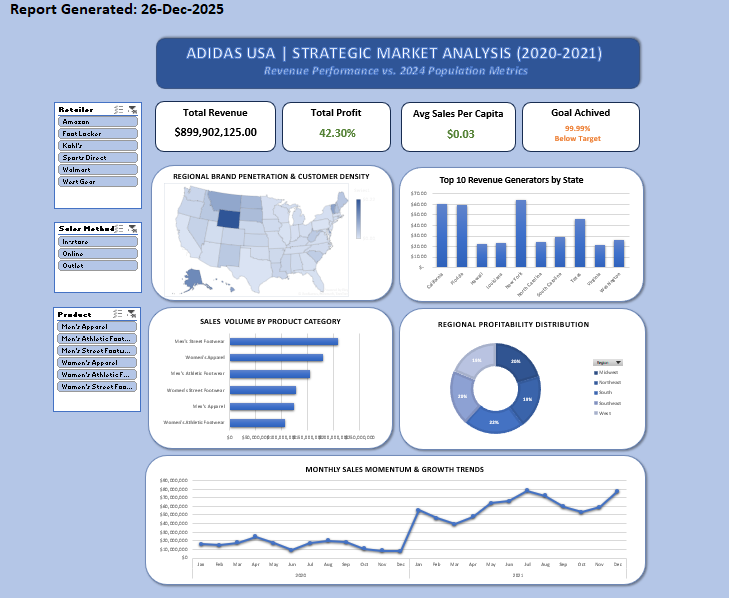

## 📊 Adidas USA Sales Analysis Project (2020-2021)

---

## 🔍 **Project Overview**
This project demonstrates **corporate-level Excel Data Analytics** using a multi-dimensional Adidas sales dataset. The goal was to simulate a **strategic market review** by cleaning raw data and building an interactive dashboard that focuses on **actionable insights** rather than just static charts.

The project is structured to answer high-impact business questions, specifically focusing on **Target Achievement** and **Market Penetration** by merging sales data with 2024 US Population estimates.

---

## 🎯 **Objectives**
* Apply **Power Query** to automate the cleaning and merging of fragmented datasets.
* Demonstrate advanced **Data Modeling** by connecting Sales, Population, and Target metrics.
* Think like a **Data Analyst** by developing a "Sales Per Capita" metric to identify untapped markets.
* Deliver a **UI/UX optimized dashboard** that is secure and user-friendly.

---

## 🛠 **Tools & Technologies**
* **Software:** Microsoft Excel (v2021/365)
* **Data Engine:** **Power Query** (M-Language) for ETL processes.
* **Concepts Used:**
    * Data Cleaning & Type Transformation (ETL)
    * Table Joins & Appending
    * DAX-style Pivot Calculations
    * Dynamic US Choropleth Mapping
    * Interactive Slicers & Timeline Filters
    * Workbook Security & Protection

---

## 📂 **Project Structure**
The project is contained within a single, highly-structured Excel Workbook. To maintain professionalism, the "Back-end" is separated from the "Front-end":

* **Dashboard**: The primary user interface with KPIs, Slicers, and Visualizations.
* **cleaned_data**: The final output of the Power Query ETL process.
* **calculation**: Dedicated sheet for target-tracking logic and per-capita math.
* **pivot data**: The engine room where all charts are calculated via Pivot Tables.
* **Data Folder**: Contains the original raw CSV files used for the analysis.

---

## 📈 **Business Insights Covered**
* **Target vs. Actual Performance:** Tracks the $899.9M revenue against a $900M corporate goal (99.99% achievement).
* **Market Penetration (Sales Per Capita):** Normalized sales against state population to find "cold" spots in high-population areas.
* **Regional Profitability:** Comparison of revenue distribution across the West, Northeast, Southeast, and Midwest.
* **Product Performance:** Identifying which categories (Apparel vs. Footwear) drive the highest margins.
* **Sales Channel Analysis:** Comparing In-store vs. Online vs. Outlet efficiency.

---

## 🧠 **Key Learnings**
* **Automating ETL:** Moving from manual cell edits to a "Refreshable" Power Query pipeline.
* **Strategic Metrics:** Understanding that "Total Sales" is less important than "Sales per Capita" for expansion.
* **Dashboard UI/UX:** Learning how to lock charts and objects to create a foolproof tool for executives.

---
## 🏁 **Conclusion**

This project demonstrates how Excel can be transformed into a powerful BI tool through structured data management. By answering high-impact questions and securing the interface, the project reflects the practical analytics work required to support executive decision-making in a retail corporate environment.
